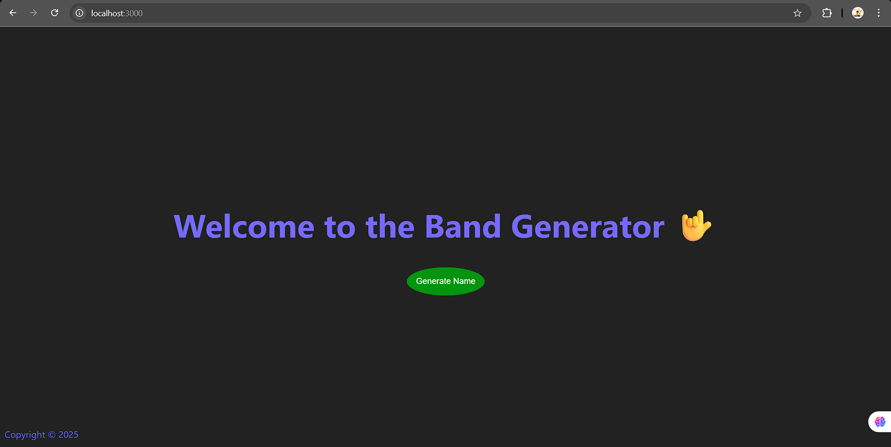
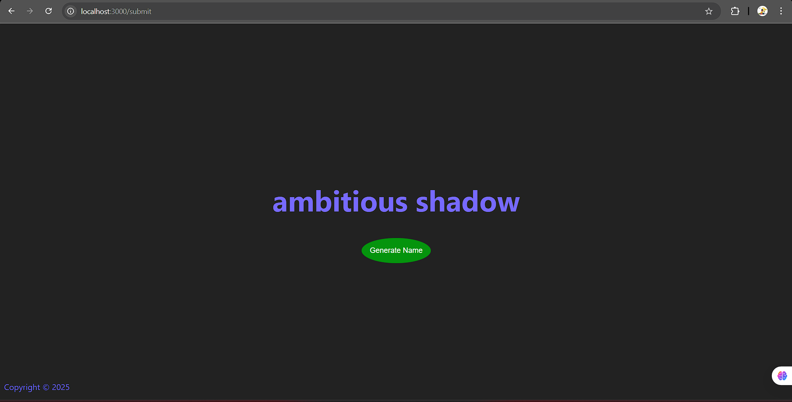

# Band Name Generator 🎸

A fun web app to generate random **band names** using **Node.js**, **Express**, and **EJS**.  
Users can click a button to generate creative band names combining random adjectives and nouns.

---

## 🚀 Features
- Random band name generation
- Simple and clean UI
- Built with **Node.js**, **Express**, and **EJS**
- Fully responsive

---

## 🛠️ Technologies Used
- **Node.js** – Backend server
- **Express.js** – Web framework
- **EJS** – Templating engine for rendering HTML
- **CSS3** – Styling

---

## 📂 Project Structure
